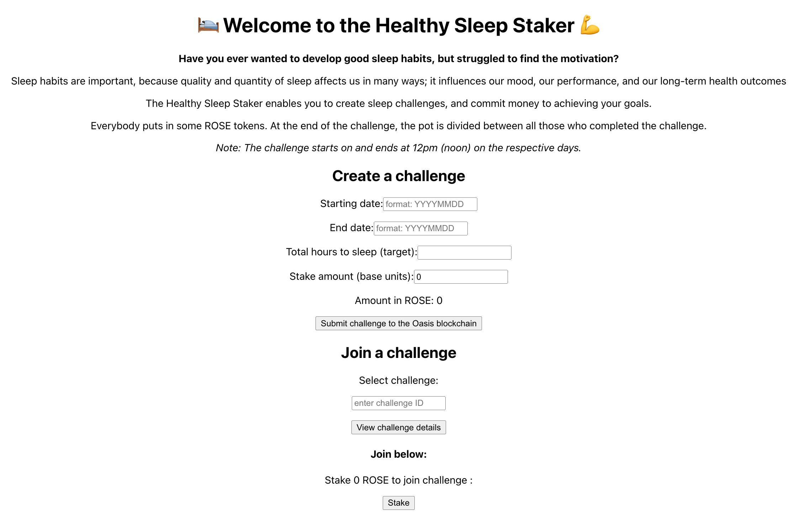
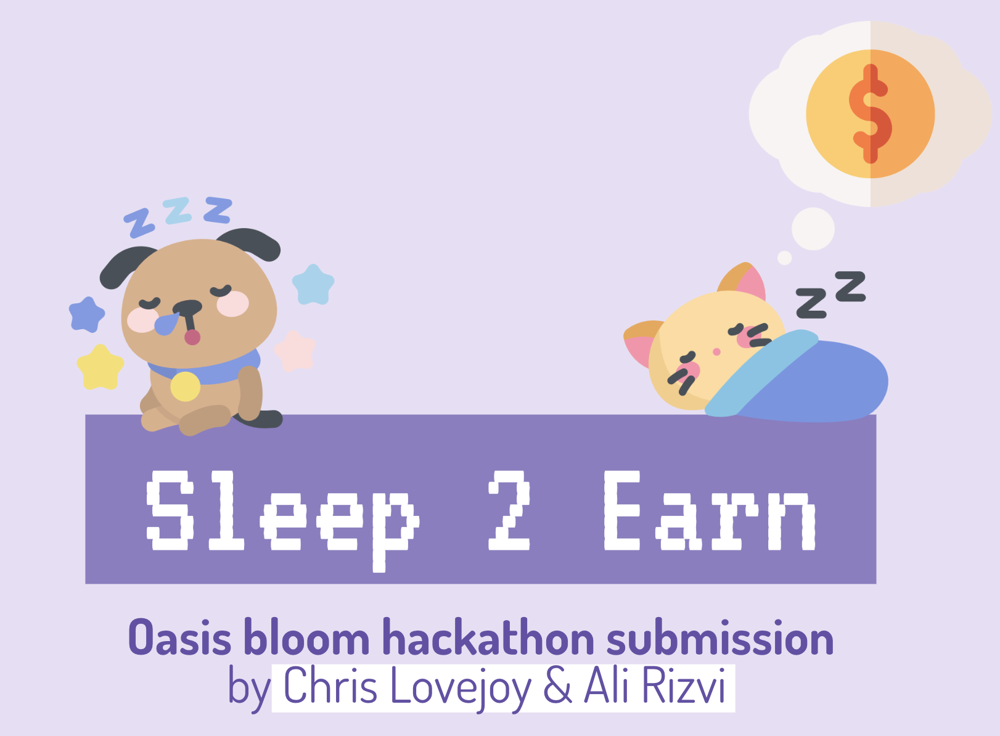

# The Healthy Sleep Staker

Healthy Sleep Staker enables you to develop sleep habits through gameFi and socialFi mechanisms. Create sleep challenges, stake tokens, invite friends - the pot's divided between those who complete it

[](https://github.com/meyer1994/ipgit/actions/workflows/build.yml)
[](https://github.com/RichardLitt/standard-readme)

This was originally built as a submission for the Oasis Bloom Hackathon. The devpost submission can be found [here](https://devpost.com/software/the-healthy-sleep-staker).


## Table of Contents

- [About](#about)
- [Install](#install)
- [Screenshots](#screenshots)
- [Next Steps](#next-steps)


## About

### Inspiration
Sleep is a fundamental pillar for a healthy life, but so many people struggle. As a medical doctor, I (Chris) saw many people who suffered from insomnia, narcolepsy and other sleep disorders. And amongst those without sleep disorders, many struggle to get the sleep they would like.

In searching for a solution, we observed three interesting trends. First is the emergence of gameFi mechanisms for incentivising healthy behaviour, such as STEPN. Second are communities built around health challenges, such as through Strava. Third is the power of financial mechanisms on behaviour and habit formation, such as Beeminder. We decided to combine these three elements to create the Healthy Sleep Staker.

### What it does
It enables people to develop healthy sleep habits through gameFi and socialFi mechanisms. Users can define sleep challenges and invite their friends. All participants stake ROSE tokens. At the end of the challenge, people share data on how they slept. Those who successfully finish the challenge will share in the prize pool.

### How we built it
To build the smart contracts, we used the scaffold-eth framework and hardhat for quick iteration. After creating functioning contracts, we followed tutorials from the Oasis Protocol on how to deploy on Emerald. With the contracts successfully deployed on the Emerald Testnet, we built out the front-end using React. 

### Challenges we ran into
When building the smart contracts, some of the indexing was challenging, given different data formats and the mappings of mappings that we used. We believe these data structures were necessary, but haven't limited experience with Solidity prior to this project, it took some time to create the desired functionality. Additionally, there were some edge cases (such as no-one joining a challenge or the same person trying to join twice) which took time to deal with.

### Accomplishments that we're proud of
- Building the world's first sleep-to-earn DApp
- Building the first DApp on Oasis that utilises sleep data (to our knowledge)
- Implementing lots of on-chain logic for managing challenges, participants, who met challenge thresholds and for concluding challenges

### What we learned
- How fast and cheap transactions (enabled by Oasis) can lead to greater amounts of fast on-chain logic, without harming the user experience
- How easy it is to deploy the front-end via Vercel
- Different approaches to staking tokens in smart contracts

## Install

#### Download repository
```sh
git clone https://github.com/chris-lovejoy/healthy-sleep-staker
cd healthy-sleep-staker
```

#### Deploy smart contracts

Add PRIVATE_KEY to env.

```sh
cd src/hardhat
npm install
npx hardhat compile
npx hardhat run scripts/deploy.js --network <your-network>
```

Specify network as per hardhat.config.js.


#### Run front-end

```sh
cd ../
npm install
npm run
```

## Screenshots




## Next Steps
We want to integrate Oura ring via their API to bring in high-quality sleep data, as well as validation mechanisms to ensure high data integrity. We're going to extend our DApp to other types of habit building, such as meditation, exercise and food consumption. We want to leverage the Oasis Parcel ParaTime to store sensitive health-relevant data in secure enclaves.
